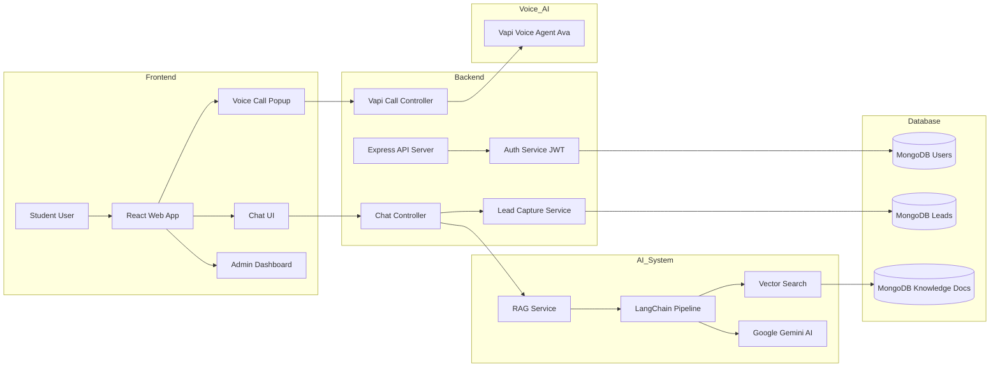

# 🎓 EduReach — Agentic AI College Counselor


EduReach is an **AI-powered college admissions platform** that helps students explore courses, placements, mentors, and campus information using an **intelligent chatbot and voice assistant**.

The platform uses **Retrieval-Augmented Generation (RAG)** to answer student questions using a **private college knowledge base**.

---

# 🚀 Features

* 🤖 AI College Counselor Chatbot
* 🧠 Retrieval-Augmented Generation (RAG)
* 🔎 MongoDB Atlas Vector Search
* ✨ Google Gemini AI Integration
* 📞 AI Voice Counselor (Vapi)
* 📊 Lead Capture from Chatbot
* 🧑‍💼 Admin Dashboard for Admissions Team
* 🎨 Modern React UI

---

# 🧠 AI System Architecture



---

# 🧠 AI Flow

```
Student Question
        ↓
React Frontend
        ↓
Express API
        ↓
LangChain RAG Pipeline
        ↓
MongoDB Atlas Vector Search
        ↓
Google Gemini AI
        ↓
Accurate AI Response
```

---

# 🏗 Tech Stack

## Frontend

* React
* TypeScript
* Vite
* TailwindCSS

## Backend

* Node.js
* Express
* MongoDB Atlas
* LangChain
* Google Gemini AI

## AI Services

* Vector Search
* RAG Pipeline
* Vapi Voice AI

---

# 📂 Project Structure

```
edureach/
│
├── client/
│   ├── components
│   ├── pages
│   ├── services
│   └── context
│
├── server/
│   ├── controllers
│   ├── routes
│   ├── models
│   ├── services
│   └── knowledge-base
```

---

# 🤖 AI Capabilities

Students can ask questions like:

* What is the fee for B.Tech CSE?
* What companies visit for placements?
* What courses are available?
* How do I apply for admission?

The AI retrieves answers directly from the **EduReach knowledge base** using **RAG architecture**.

---

# 📞 Voice AI Counselor

Students can request a call from **Ava**, the AI admissions counselor.

The system uses **Vapi Voice AI** to initiate outbound calls and provide information through **real-time voice conversations**.

---

# 📊 Lead Capture

If a student asks about admissions, the chatbot automatically captures a lead:

```
{
  name: "Website Visitor",
  interest: "I want admission in CSE",
  source: "chatbot"
}
```

Admissions teams can view leads inside the **admin dashboard**.

---

# ⚡ Getting Started

## Install dependencies

### Frontend

```
cd client
npm install
npm run dev
```

### Backend

```
cd server
npm install
npm run dev
```

---

# 🌐 Environment Variables

Create `.env` inside **server/**

```
PORT=5000
MONGODB_URI=your_mongodb_uri
JWT_SECRET=your_secret
GOOGLE_API_KEY=your_gemini_key

VAPI_API_KEY=your_vapi_key
VAPI_ASSISTANT_ID=assistant_id
VAPI_PHONE_NUMBER_ID=phone_id
```

---

# 📸 Demo

* Homepage with AI counselor
* Chatbot answering college queries
* Voice assistant call request
* Admin dashboard showing captured leads

---

# 🎯 Future Improvements

* 📊 AI analytics dashboard
* 🧠 Conversation memory
* 🏫 Multi-college knowledge base
* 📱 WhatsApp AI counselor
* 🎙 Real-time voice chatbot

---

# 👨‍💻 Author

EduReach AI Platform

Built with **modern AI architecture using RAG, Vector Search, and Voice Agents**.
